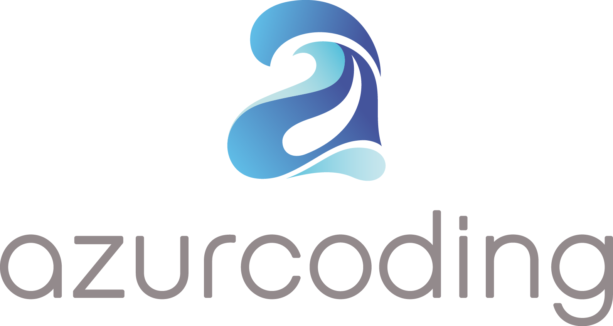

# AZSignupController

[](https://travis-ci.org/azurcoding/AZSignupController)
[](http://cocoapods.org/pods/AZSignupController)
[](https://opensource.org/licenses/MIT)
[](http://cocoapods.org/pods/AZSignupController)

## Example

To run the example project, clone the repo, and run `pod install` from the Example directory first.

## Installation

AZSignupController is available through [CocoaPods](http://cocoapods.org). To install
it, simply add the following line to your Podfile:

```ruby
pod 'AZSignupController'
```

## License

AZSignupController is available under the MIT license. See the LICENSE file for more info.


## Author
AZSignupController is brought to you by Azurcoding
[](https://azurcoding.com)
